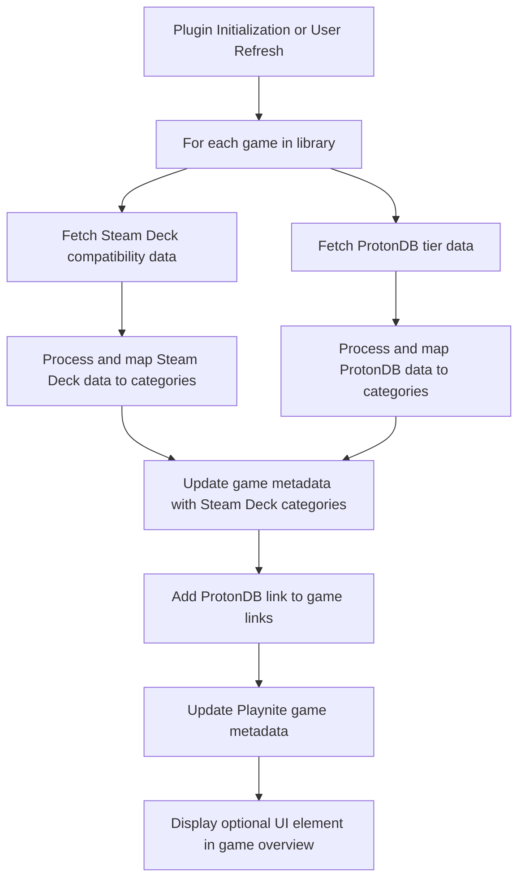

# Playnite Plugin Plan: Steam Deck and ProtonDB Metadata Integration

## Plugin Architecture

### Components

1. **Metadata Fetcher**
   - Fetches Steam Deck compatibility data from Steam API or local Steam metadata.
   - Fetches ProtonDB tier data from ProtonDB Community API using Steam AppId.
   - Caches results to minimize API calls.

2. **Metadata Processor**
   - Maps Steam Deck compatibility levels to Playnite categories:
     - "Verified" → Category: "Steam Deck Verified"
     - "Playable" → Category: "Steam Deck Playable"
     - Both also added to Category: "Steam Deck"
     - "Unsupported" ignored
   - Maps ProtonDB tiers to Playnite categories:
     - "ProtonDB <TIER>" (e.g., "ProtonDB Platinum") as categories.

3. **Game Metadata Updater**
   - Updates Playnite game metadata with categories as per above.
   - Adds ProtonDB link to the game's links section.

4. **User Interface**
   - Settings page for API keys (if needed) and user preferences:
     - Choose whether to add tags, categories, or features for Steam Deck and ProtonDB data.
   - Optional UI element in game overview showing Steam Deck and ProtonDB status.

5. **Integration Layer**
   - Hooks into Playnite's extension points for metadata updates and UI customization.
   - Supports integration with popular Playnite templates like FusionX by exposing UI elements or metadata in compatible ways.

## Data Flow

## Notes

- ProtonDB API has limited endpoints enabled; plugin queries individual game summaries by Steam AppId.
- Steam Deck compatibility data source to be identified (Steam API or local metadata).
- Plugin written in C# targeting .NET Framework 4.6.2.
- Caching and rate limiting to avoid excessive API calls.

---

This plan outlines the core architecture and data flow for the plugin. It includes user configuration options and integration considerations for Playnite templates.

Please review and confirm if you approve this plan or would like any changes.
